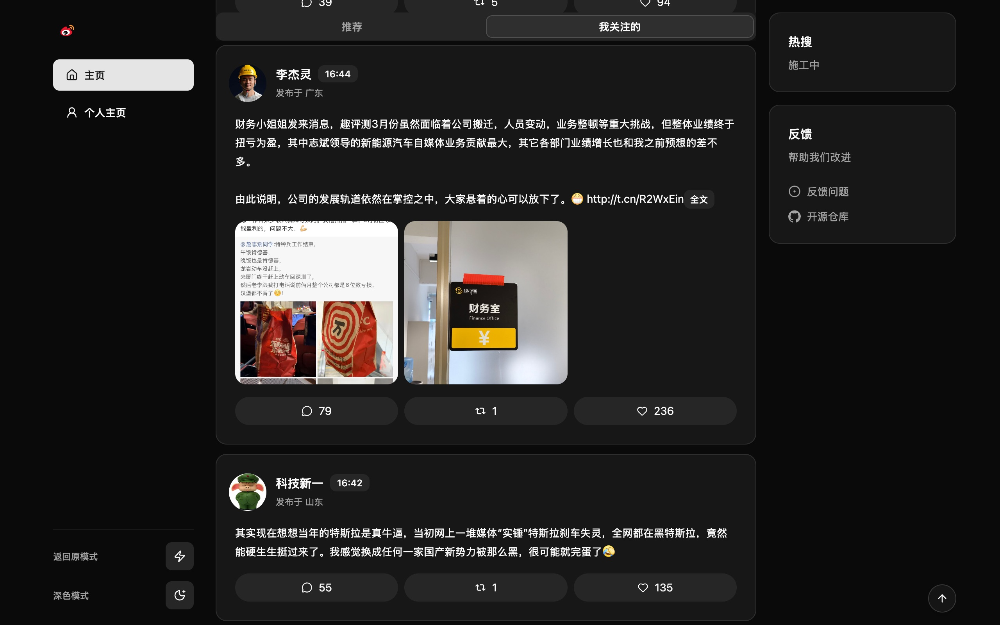

# xb

🥷 xb - Make weibo X-liked and simpler.

[中文](./README.cn.md)

xb strips away the noise and gives you a focused, distraction-free reading
experience — similar to X (Twitter).

xb runs directly in your browser. Once installed, simply browse Weibo as usual
and enjoy the beautifully redesigned interface.

---

## Features

1. ✨ **X like Style** — Clean, reading-first
2. 🔓 **Fully Open Source** — No privacy concerns
3. 🎯 **Focus on Reading** — Distraction-free feed
4. 🚫 **No Interruptions** — No stickers, ads, or supertopics

---

## Supported Pages

xb currently enhances the following pages:

- **Home Timeline**
- **Profile Page**
- **Status Detail**
